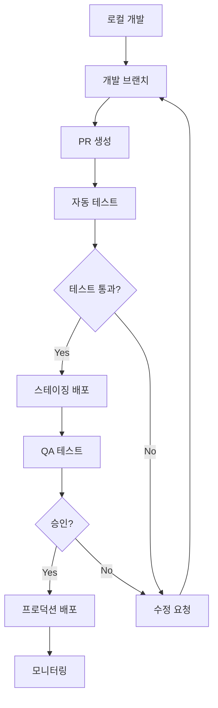

# Deployment & Operations Guide

## 🚀 배포 가이드

### 프로덕션 배포 전략

#### 배포 환경 구성



#### 환경별 설정

| 환경 | URL | 브랜치 | 목적 |
|------|-----|--------|------|
| **로컬** | `localhost:3000` | `feature/*` | 개발 및 테스트 |
| **개발** | `dev.posmul.com` | `develop` | 통합 테스트 |
| **스테이징** | `staging.posmul.com` | `main` | QA 및 사용자 테스트 |
| **프로덕션** | `posmul.com` | `main` | 실제 서비스 |

---

## 🔧 Vercel 배포 설정

### 1. Vercel 프로젝트 생성

#### CLI를 통한 배포
```bash
# Vercel CLI 설치
npm i -g vercel

# 프로젝트 루트에서 배포
vercel

# 프로덕션 배포
vercel --prod
```

#### GitHub 연동 배포
1. **Vercel 대시보드** 접속 (vercel.com)
2. **Import Git Repository** 선택
3. **GitHub 저장소** 연결
4. **프로젝트 설정** 구성

### 2. 빌드 설정

#### `next.config.js` 최적화
```javascript
/** @type {import('next').NextConfig} */
const nextConfig = {
  // 이미지 최적화
  images: {
    domains: ['github.com', 'avatars.githubusercontent.com'],
    formats: ['image/webp', 'image/avif'],
  },
  
  // 번들 분석
  webpack: (config, { buildId, dev, isServer, defaultLoaders, webpack }) => {
    if (process.env.ANALYZE === 'true') {
      const { BundleAnalyzerPlugin } = require('webpack-bundle-analyzer');
      config.plugins.push(
        new BundleAnalyzerPlugin({
          analyzerMode: 'static',
          openAnalyzer: false,
        })
      );
    }
    return config;
  },
  
  // 실험적 기능
  experimental: {
    serverComponentsExternalPackages: ['@supabase/supabase-js'],
  },
  
  // 보안 헤더
  async headers() {
    return [
      {
        source: '/(.*)',
        headers: [
          {
            key: 'X-Frame-Options',
            value: 'DENY',
          },
          {
            key: 'X-Content-Type-Options',
            value: 'nosniff',
          },
          {
            key: 'Referrer-Policy',
            value: 'origin-when-cross-origin',
          },
        ],
      },
    ];
  },
};

module.exports = nextConfig;
```

#### `package.json` 스크립트
```json
{
  "scripts": {
    "dev": "next dev",
    "build": "next build",
    "start": "next start",
    "lint": "next lint",
    "test": "jest",
    "test:watch": "jest --watch",
    "test:e2e": "cypress run",
    "test:e2e:open": "cypress open",
    "type-check": "tsc --noEmit",
    "analyze": "ANALYZE=true npm run build"
  }
}
```

### 3. 환경 변수 설정

#### Vercel 환경 변수 구성
```bash
# Production 환경
NEXT_PUBLIC_SUPABASE_URL=https://your-project.supabase.co
NEXT_PUBLIC_SUPABASE_ANON_KEY=your-anon-key
SUPABASE_SERVICE_ROLE_KEY=your-service-role-key
GITHUB_TOKEN=your-github-token
GITHUB_WEBHOOK_SECRET=your-webhook-secret
NEXTAUTH_SECRET=your-nextauth-secret
SENTRY_DSN=your-sentry-dsn

# Preview 환경
NEXT_PUBLIC_SUPABASE_URL=https://your-staging-project.supabase.co
# ... 스테이징 환경용 키들
```

#### 환경별 설정 파일
```typescript
// lib/config/environment.ts
export const config = {
  supabase: {
    url: process.env.NEXT_PUBLIC_SUPABASE_URL!,
    anonKey: process.env.NEXT_PUBLIC_SUPABASE_ANON_KEY!,
    serviceRoleKey: process.env.SUPABASE_SERVICE_ROLE_KEY!,
  },
  github: {
    token: process.env.GITHUB_TOKEN!,
    webhookSecret: process.env.GITHUB_WEBHOOK_SECRET!,
  },
  app: {
    url: process.env.NODE_ENV === 'production' 
      ? 'https://posmul.com' 
      : 'http://localhost:3000',
    environment: process.env.NODE_ENV,
  },
};
```

---

## 🌐 도메인 및 DNS 설정

### 1. posmul.com 도메인 연결

#### Vercel 도메인 설정
1. **Vercel Dashboard** → **Projects** → **lg-dx-dashboard**
2. **Settings** → **Domains** 탭
3. **Add Domain** → `posmul.com` 입력
4. **Add** 클릭

#### DNS 설정 (도메인 제공업체)
```
Type: CNAME
Name: www
Value: cname.vercel-dns.com

Type: A
Name: @
Value: 76.76.21.21
```

#### 서브도메인 설정 (선택사항)
```
api.posmul.com → API 엔드포인트
admin.posmul.com → 관리자 페이지
blog.posmul.com → 블로그 (추후)
```

### 2. SSL 인증서

Vercel은 Let's Encrypt를 통해 자동으로 SSL 인증서를 발급하고 갱신합니다.

- **자동 HTTPS 리다이렉션** 활성화
- **HTTP Strict Transport Security (HSTS)** 설정
- **인증서 자동 갱신** 확인

---

## 🔄 CI/CD 파이프라인

### 1. GitHub Actions 워크플로우

#### `.github/workflows/ci.yml`
```yaml
name: CI Pipeline

on:
  push:
    branches: [ main, develop ]
  pull_request:
    branches: [ main ]

jobs:
  test:
    runs-on: ubuntu-latest

    steps:
    - uses: actions/checkout@v3
    
    - name: Setup Node.js
      uses: actions/setup-node@v3
      with:
        node-version: '18'
        cache: 'npm'
    
    - name: Install dependencies
      run: npm ci
    
    - name: Type check
      run: npm run type-check
    
    - name: Lint
      run: npm run lint
    
    - name: Run tests
      run: npm run test
    
    - name: Build
      run: npm run build
    
    - name: E2E tests
      run: npm run test:e2e
      env:
        CYPRESS_RECORD_KEY: ${{ secrets.CYPRESS_RECORD_KEY }}
```

#### `.github/workflows/deploy.yml`
```yaml
name: Deploy to Production

on:
  push:
    branches: [ main ]

jobs:
  deploy:
    runs-on: ubuntu-latest
    if: github.ref == 'refs/heads/main'

    steps:
    - uses: actions/checkout@v3
    
    - name: Deploy to Vercel
      uses: amondnet/vercel-action@v20
      with:
        vercel-token: ${{ secrets.VERCEL_TOKEN }}
        vercel-org-id: ${{ secrets.ORG_ID }}
        vercel-project-id: ${{ secrets.PROJECT_ID }}
        vercel-args: '--prod'
```

### 2. 자동화된 품질 게이트

#### Lighthouse CI
```yaml
# .github/workflows/lighthouse.yml
name: Lighthouse CI

on:
  pull_request:
    branches: [ main ]

jobs:
  lighthouse:
    runs-on: ubuntu-latest
    
    steps:
    - uses: actions/checkout@v3
    
    - name: Run Lighthouse CI
      uses: treosh/lighthouse-ci-action@v9
      with:
        configPath: './lighthouserc.json'
        uploadArtifacts: true
        temporaryPublicStorage: true
```

#### `lighthouserc.json`
```json
{
  "ci": {
    "collect": {
      "url": ["http://localhost:3000"],
      "startServerCommand": "npm run start",
      "numberOfRuns": 3
    },
    "assert": {
      "assertions": {
        "categories:performance": ["error", {"minScore": 0.9}],
        "categories:accessibility": ["error", {"minScore": 0.9}],
        "categories:best-practices": ["error", {"minScore": 0.9}],
        "categories:seo": ["error", {"minScore": 0.9}]
      }
    }
  }
}
```

---

## 📊 모니터링 및 로깅

### 1. Sentry 에러 트래킹

#### 설치 및 설정
```bash
npm install @sentry/nextjs
npx @sentry/wizard -i nextjs
```

#### `sentry.client.config.js`
```javascript
import * as Sentry from "@sentry/nextjs";

Sentry.init({
  dsn: process.env.SENTRY_DSN,
  tracesSampleRate: 1.0,
  debug: false,
  environment: process.env.NODE_ENV,
  beforeSend(event) {
    // 개발 환경에서는 에러를 콘솔에도 출력
    if (process.env.NODE_ENV === 'development') {
      console.error(event);
    }
    return event;
  },
});
```

#### 커스텀 에러 핸들링
```typescript
// lib/monitoring/error-handler.ts
import * as Sentry from "@sentry/nextjs";

export const logError = (error: Error, context?: Record<string, any>) => {
  console.error('Error occurred:', error);
  
  Sentry.withScope((scope) => {
    if (context) {
      Object.keys(context).forEach(key => {
        scope.setTag(key, context[key]);
      });
    }
    Sentry.captureException(error);
  });
};

export const logUserAction = (action: string, userId?: string) => {
  Sentry.addBreadcrumb({
    message: action,
    category: 'user-action',
    data: { userId },
    level: 'info',
  });
};
```

### 2. 성능 모니터링

#### Vercel Analytics
```typescript
// app/layout.tsx
import { Analytics } from '@vercel/analytics/react';

export default function RootLayout({
  children,
}: {
  children: React.ReactNode;
}) {
  return (
    <html lang="ko">
      <body>
        {children}
        <Analytics />
      </body>
    </html>
  );
}
```

#### Web Vitals 추적
```typescript
// lib/monitoring/web-vitals.ts
import { getCLS, getFID, getFCP, getLCP, getTTFB } from 'web-vitals';

function sendToAnalytics(metric: any) {
  // Google Analytics 또는 다른 분석 도구로 전송
  if (window.gtag) {
    window.gtag('event', metric.name, {
      value: Math.round(metric.name === 'CLS' ? metric.value * 1000 : metric.value),
      event_label: metric.id,
      non_interaction: true,
    });
  }
}

getCLS(sendToAnalytics);
getFID(sendToAnalytics);
getFCP(sendToAnalytics);
getLCP(sendToAnalytics);
getTTFB(sendToAnalytics);
```

### 3. 사용자 행동 분석

#### 커스텀 이벤트 추적
```typescript
// lib/analytics/tracking.ts
export const trackEvent = (
  event: string, 
  properties?: Record<string, any>
) => {
  if (typeof window !== 'undefined') {
    // Google Analytics
    if (window.gtag) {
      window.gtag('event', event, properties);
    }
    
    // Mixpanel (선택사항)
    if (window.mixpanel) {
      window.mixpanel.track(event, properties);
    }
  }
};

// 사용 예시
export const trackReflectionSubmitted = (timepart: string) => {
  trackEvent('reflection_submitted', { timepart });
};

export const trackDashboardViewed = () => {
  trackEvent('dashboard_viewed');
};
```

---

## 🔒 보안 및 백업

### 1. 보안 설정

#### Content Security Policy
```typescript
// next.config.js
const ContentSecurityPolicy = `
  default-src 'self';
  script-src 'self' 'unsafe-eval' 'unsafe-inline' *.vercel-insights.com;
  child-src 'self';
  style-src 'self' 'unsafe-inline';
  img-src 'self' blob: data: *.githubusercontent.com;
  media-src 'none';
  connect-src *;
  font-src 'self';
`;

const securityHeaders = [
  {
    key: 'Content-Security-Policy',
    value: ContentSecurityPolicy.replace(/\n/g, ''),
  },
  {
    key: 'Referrer-Policy',
    value: 'origin-when-cross-origin',
  },
  {
    key: 'X-Frame-Options',
    value: 'DENY',
  },
  {
    key: 'X-Content-Type-Options',
    value: 'nosniff',
  },
  {
    key: 'X-DNS-Prefetch-Control',
    value: 'false',
  },
  {
    key: 'Strict-Transport-Security',
    value: 'max-age=31536000; includeSubDomains; preload',
  },
  {
    key: 'Permissions-Policy',
    value: 'camera=(), microphone=(), geolocation=()',
  },
];
```

#### API 보안
```typescript
// lib/auth/api-protection.ts
export async function withAuth(
  req: Request,
  handler: (req: Request, user: User) => Promise<Response>
) {
  try {
    const token = req.headers.get('Authorization')?.replace('Bearer ', '');
    
    if (!token) {
      return new Response('Unauthorized', { status: 401 });
    }
    
    const user = await verifyToken(token);
    
    if (!user) {
      return new Response('Invalid token', { status: 401 });
    }
    
    return await handler(req, user);
  } catch (error) {
    return new Response('Internal Server Error', { status: 500 });
  }
}
```

### 2. 백업 전략

#### Supabase 백업
```sql
-- 일일 백업 스케줄 (Supabase Dashboard에서 설정)
-- 또는 수동 백업 스크립트

-- 테이블 백업
COPY daily_reflections TO '/backup/reflections_2025_07_12.csv' DELIMITER ',' CSV HEADER;
COPY users TO '/backup/users_2025_07_12.csv' DELIMITER ',' CSV HEADER;
```

#### 자동화된 백업 스크립트
```bash
#!/bin/bash
# scripts/backup.sh

DATE=$(date +%Y_%m_%d)
BACKUP_DIR="/backups/$DATE"

# Supabase 백업
npx supabase db dump --file "$BACKUP_DIR/database.sql"

# 환경 변수 백업 (암호화)
gpg --symmetric --cipher-algo AES256 --output "$BACKUP_DIR/env.gpg" .env.local

# Vercel 설정 백업
vercel env pull "$BACKUP_DIR/.env.vercel"

echo "Backup completed: $BACKUP_DIR"
```

#### 재해 복구 계획
1. **RTO (Recovery Time Objective)**: 4시간
2. **RPO (Recovery Point Objective)**: 1시간
3. **백업 주기**: 일일 자동 백업
4. **복구 테스트**: 월 1회

---

## 🚨 장애 대응 및 모니터링

### 1. 헬스체크 시스템

#### `/api/health/route.ts`
```typescript
export async function GET() {
  try {
    // 데이터베이스 연결 확인
    const { data, error } = await supabase
      .from('users')
      .select('count')
      .limit(1);
    
    if (error) throw error;
    
    // GitHub API 연결 확인
    const githubResponse = await fetch('https://api.github.com/rate_limit', {
      headers: { Authorization: `token ${process.env.GITHUB_TOKEN}` },
    });
    
    if (!githubResponse.ok) throw new Error('GitHub API unavailable');
    
    return Response.json({
      status: 'healthy',
      timestamp: new Date().toISOString(),
      services: {
        database: 'operational',
        github: 'operational',
      },
    });
  } catch (error) {
    return Response.json({
      status: 'unhealthy',
      timestamp: new Date().toISOString(),
      error: error.message,
    }, { status: 503 });
  }
}
```

### 2. 알림 시스템

#### Discord/Slack 웹훅 알림
```typescript
// lib/monitoring/alerts.ts
export async function sendAlert(
  level: 'info' | 'warning' | 'error',
  message: string,
  details?: any
) {
  const webhookUrl = process.env.DISCORD_WEBHOOK_URL;
  
  if (!webhookUrl) return;
  
  const color = {
    info: 0x0099ff,
    warning: 0xff9900,
    error: 0xff0000,
  }[level];
  
  await fetch(webhookUrl, {
    method: 'POST',
    headers: { 'Content-Type': 'application/json' },
    body: JSON.stringify({
      embeds: [{
        title: `[${level.toUpperCase()}] LG DX Dashboard`,
        description: message,
        color,
        fields: details ? Object.entries(details).map(([key, value]) => ({
          name: key,
          value: String(value),
          inline: true,
        })) : [],
        timestamp: new Date().toISOString(),
      }],
    }),
  });
}
```

### 3. 로그 집계

#### 구조화된 로깅
```typescript
// lib/monitoring/logger.ts
import winston from 'winston';

const logger = winston.createLogger({
  level: process.env.LOG_LEVEL || 'info',
  format: winston.format.combine(
    winston.format.timestamp(),
    winston.format.errors({ stack: true }),
    winston.format.json()
  ),
  defaultMeta: { service: 'lg-dx-dashboard' },
  transports: [
    new winston.transports.Console({
      format: winston.format.simple()
    }),
  ],
});

export { logger };
```

---

## 📈 성능 최적화 가이드

### 1. 빌드 최적화

#### 번들 분석
```bash
# 번들 크기 분석
npm run analyze

# 불필요한 의존성 제거
npx depcheck

# 패키지 중복 확인
npx npm-check-updates
```

#### 코드 스플리팅
```typescript
// 동적 임포트 최적화
const AnalyticsPage = dynamic(
  () => import('./analytics').then(mod => mod.AnalyticsPage),
  {
    loading: () => <AnalyticsSkeleton />,
    ssr: false, // 클라이언트에서만 로드
  }
);
```

### 2. 데이터베이스 최적화

#### 쿼리 최적화
```sql
-- 인덱스 사용 확인
EXPLAIN ANALYZE SELECT * FROM daily_reflections 
WHERE user_id = 'user-uuid' AND date >= '2025-07-01';

-- 필요한 인덱스 추가
CREATE INDEX IF NOT EXISTS idx_reflections_user_date_desc 
ON daily_reflections(user_id, date DESC);
```

#### 연결 풀 최적화
```typescript
// lib/supabase/optimized-client.ts
import { createClient } from '@supabase/supabase-js';

export const supabase = createClient(
  process.env.NEXT_PUBLIC_SUPABASE_URL!,
  process.env.NEXT_PUBLIC_SUPABASE_ANON_KEY!,
  {
    db: {
      schema: 'public',
    },
    auth: {
      autoRefreshToken: true,
      persistSession: true,
      detectSessionInUrl: true,
    },
    realtime: {
      params: {
        eventsPerSecond: 10, // 실시간 이벤트 제한
      },
    },
  }
);
```

---

## 🔄 유지보수 가이드

### 1. 정기 점검 항목

#### 주간 점검
- [ ] 시스템 가용성 확인
- [ ] 에러 로그 분석
- [ ] 성능 지표 검토
- [ ] 백업 상태 확인

#### 월간 점검
- [ ] 보안 업데이트 적용
- [ ] 의존성 버전 업데이트
- [ ] 데이터베이스 성능 최적화
- [ ] 사용자 피드백 수집

### 2. 업데이트 프로세스

#### 의존성 업데이트
```bash
# 보안 업데이트 확인
npm audit

# 패키지 업데이트
npx npm-check-updates -u
npm install

# 테스트 실행
npm run test
npm run build
```

#### 기능 업데이트 배포
1. 기능 브랜치에서 개발
2. 테스트 및 코드 리뷰
3. 스테이징 환경 배포
4. QA 테스트
5. 프로덕션 배포
6. 모니터링

---

**📅 마지막 업데이트**: 2025-07-12  
**🔄 다음 리뷰**: 2025-08-12  
**📋 담당자**: 개발팀  
**🆘 긴급 연락처**: posmul.com 관리자  