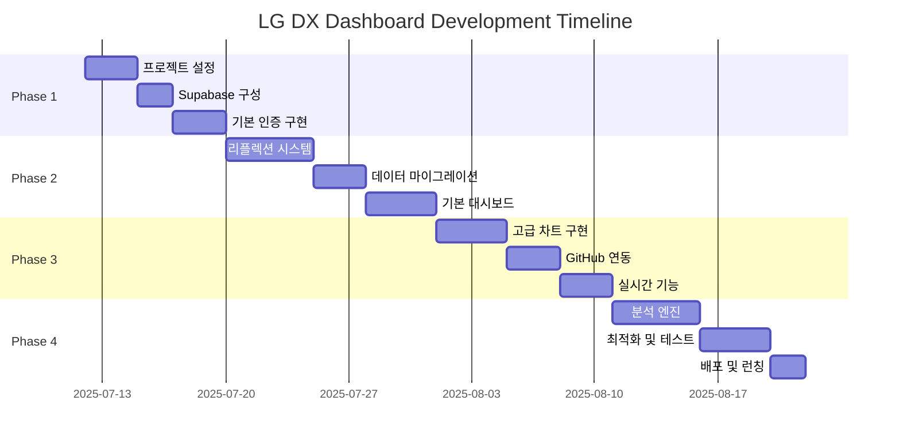

# Implementation Phases & Development Roadmap

## 🚀 전체 개발 로드맵

**총 개발 기간**: 4-6주 (스프린트별 1-2주)  
**개발 방법론**: Agile 기반 스프린트  
**배포 전략**: 점진적 배포 (Progressive Deployment)



---

## 📋 Phase 1: Foundation Setup (1주차)

### 🎯 목표
- 프로젝트 기본 환경 구성
- Supabase 설정 및 인증 시스템 구현
- 기본 UI 컴포넌트 구현

### 📦 주요 결과물
- Next.js 14 프로젝트 구조
- Supabase 연동 및 데이터베이스 스키마
- 사용자 인증 시스템
- 기본 레이아웃 컴포넌트

### 🔧 구현 작업

#### 1.1 프로젝트 초기 설정 (Day 1-2)
```bash
# Next.js 프로젝트 생성
npx create-next-app@latest lg-dx-dashboard --typescript --tailwind --eslint --app

# 필요한 패키지 설치
npm install @supabase/supabase-js @supabase/auth-helpers-nextjs
npm install @radix-ui/react-* lucide-react
npm install recharts framer-motion zustand
npm install react-hook-form @hookform/resolvers zod
```

**체크리스트:**
- [ ] Next.js 14 프로젝트 생성
- [ ] TypeScript 설정 완료
- [ ] Tailwind CSS 설정 및 커스터마이징
- [ ] ESLint/Prettier 설정
- [ ] 폴더 구조 생성 (components, lib, hooks, types)
- [ ] Git 저장소 설정 및 initial commit

#### 1.2 Supabase 설정 (Day 2-3)
```sql
-- 기본 테이블 생성
\i database-schema.sql

-- RLS 정책 적용
\i rls-policies.sql

-- 초기 데이터 시딩
\i seed-data.sql
```

**체크리스트:**
- [ ] Supabase 프로젝트 생성
- [ ] 데이터베이스 스키마 적용
- [ ] RLS 정책 설정
- [ ] 환경 변수 설정 (.env.local)
- [ ] Supabase 클라이언트 설정 (lib/supabase/)
- [ ] 데이터베이스 연결 테스트

#### 1.3 인증 시스템 구현 (Day 3-5)
```typescript
// app/login/page.tsx
export default function LoginPage() {
  // 로그인 페이지 구현
}

// app/signup/page.tsx  
export default function SignupPage() {
  // 회원가입 페이지 구현
}

// middleware.ts
export async function middleware(request: NextRequest) {
  // 인증 미들웨어 구현
}
```

**체크리스트:**
- [ ] 로그인/회원가입 페이지 구현
- [ ] 인증 미들웨어 설정
- [ ] 사용자 프로필 페이지
- [ ] 로그아웃 기능
- [ ] 인증 상태 관리 (Context/Zustand)
- [ ] 보호된 라우트 설정

#### 1.4 기본 UI 컴포넌트 (Day 4-5)
```typescript
// components/ui/ (Shadcn/ui 기반)
// components/layout/header.tsx
// components/layout/sidebar.tsx
// components/layout/navigation.tsx
```

**체크리스트:**
- [ ] 기본 UI 컴포넌트 라이브러리 설정
- [ ] 헤더/사이드바/네비게이션 컴포넌트
- [ ] 다크/라이트 테마 시스템
- [ ] 반응형 레이아웃
- [ ] 로딩/에러 UI 컴포넌트
- [ ] 기본 페이지 라우팅 구조

---

## 📊 Phase 2: Core Features (2주차)

### 🎯 목표
- 3-Part 리플렉션 시스템 구현
- 기존 Python 데이터 마이그레이션
- 기본 대시보드 구현

### 📦 주요 결과물
- 일일 리플렉션 입력/수정 기능
- 기존 데이터 통합
- 실시간 대시보드 뷰

### 🔧 구현 작업

#### 2.1 리플렉션 시스템 구현 (Day 6-10)
```typescript
// app/reflection/[timepart]/page.tsx
export default function ReflectionPage({ params }: { params: { timepart: string } }) {
  // 시간대별 리플렉션 페이지
}

// components/forms/reflection-form.tsx
export function ReflectionForm({ timepart, date }: ReflectionFormProps) {
  // 리플렉션 입력 폼
}

// lib/services/reflection.ts
export class ReflectionService {
  // 리플렉션 CRUD 서비스
}
```

**체크리스트:**
- [ ] 리플렉션 입력 폼 구현 (오전/오후/저녁)
- [ ] 점수 입력 UI (슬라이더/버튼)
- [ ] 텍스트 입력 필드 (성취/어려움/목표)
- [ ] 과목별 세부 점수 입력
- [ ] 리플렉션 수정/삭제 기능
- [ ] 입력 데이터 검증 (Zod 스키마)
- [ ] 리플렉션 히스토리 조회
- [ ] 실시간 자동 저장 기능

#### 2.2 데이터 마이그레이션 (Day 8-10)
```python
# scripts/migrate_python_data.py
def migrate_reflection_data():
    """기존 Python JSON 데이터를 Supabase로 마이그레이션"""
    
# scripts/migrate_github_data.py  
def migrate_github_activity():
    """GitHub 활동 데이터 마이그레이션"""
```

**체크리스트:**
- [ ] 기존 JSON 데이터 분석 및 매핑
- [ ] Python → Supabase 마이그레이션 스크립트
- [ ] 데이터 무결성 검증
- [ ] GitHub 활동 데이터 동기화
- [ ] 마이그레이션 로그 및 에러 처리
- [ ] 백업 및 롤백 전략
- [ ] 데이터 정합성 테스트

#### 2.3 기본 대시보드 구현 (Day 9-12)
```typescript
// app/dashboard/page.tsx
export default function DashboardPage() {
  // 메인 대시보드 페이지
}

// components/dashboard/today-summary.tsx
export function TodaySummary() {
  // 오늘의 요약 카드
}

// components/dashboard/weekly-overview.tsx
export function WeeklyOverview() {
  // 주간 개요 차트
}
```

**체크리스트:**
- [ ] 메인 대시보드 레이아웃
- [ ] 오늘의 3-Part 요약 카드
- [ ] 주간 성과 트렌드 차트
- [ ] 과목별 진도 현황
- [ ] 최근 리플렉션 목록
- [ ] 간단한 통계 위젯
- [ ] 실시간 데이터 업데이트
- [ ] 모바일 반응형 대시보드

---

## 📈 Phase 3: Advanced Features (3주차)

### 🎯 목표
- 고급 데이터 시각화 구현
- GitHub API 실시간 연동
- Supabase Realtime 기능 활용

### 📦 주요 결과물
- 인터랙티브 차트 및 그래프
- GitHub 활동 실시간 수집
- 실시간 알림 시스템

### 🔧 구현 작업

#### 3.1 고급 차트 구현 (Day 13-16)
```typescript
// components/charts/radar-chart.tsx
export function RadarChart({ data }: RadarChartProps) {
  // 3-Part 성과 레이더 차트
}

// components/charts/heatmap.tsx
export function ActivityHeatmap({ data }: HeatmapProps) {
  // GitHub 활동 히트맵
}

// components/charts/trend-chart.tsx
export function TrendChart({ data }: TrendChartProps) {
  // 학습 효율성 트렌드
}
```

**체크리스트:**
- [ ] 레이더 차트 (시간대별 성과 비교)
- [ ] 히트맵 (GitHub 활동 패턴)
- [ ] 라인 차트 (학습 트렌드)
- [ ] 바 차트 (과목별 진도)
- [ ] 원형 차트 (목표 달성률)
- [ ] 인터랙티브 필터링
- [ ] 차트 애니메이션
- [ ] 데이터 드릴다운 기능

#### 3.2 GitHub API 연동 (Day 15-17)
```typescript
// lib/github/api.ts
export class GitHubAPI {
  async fetchUserActivity(username: string, date: string)
  async fetchRepositories(username: string)
  async fetchCommitDetails(username: string, repo: string)
}

// api/github/webhook/route.ts
export async function POST(request: Request) {
  // GitHub 웹훅 처리
}
```

**체크리스트:**
- [ ] GitHub API 클라이언트 구현
- [ ] 사용자 활동 자동 수집
- [ ] 웹훅 설정 및 처리
- [ ] 커밋/이슈/PR 데이터 수집
- [ ] 저장소 정보 동기화
- [ ] API 레이트 리밋 처리
- [ ] 에러 처리 및 재시도 로직
- [ ] GitHub 연동 설정 UI

#### 3.3 실시간 기능 구현 (Day 16-18)
```typescript
// hooks/use-realtime.ts
export function useRealtimeReflections(userId: string) {
  // Supabase Realtime 구독
}

// components/notifications/real-time-notifications.tsx
export function RealTimeNotifications() {
  // 실시간 알림 컴포넌트
}
```

**체크리스트:**
- [ ] Supabase Realtime 설정
- [ ] 리플렉션 실시간 업데이트
- [ ] GitHub 활동 실시간 반영
- [ ] 목표 진행률 실시간 업데이트
- [ ] 알림 시스템 (토스트/푸시)
- [ ] 실시간 협업 기능 (선택사항)
- [ ] WebSocket 연결 관리
- [ ] 네트워크 끊김 처리

---

## 🧠 Phase 4: Intelligence & Optimization (4주차)

### 🎯 목표
- AI 기반 분석 엔진 구현
- 성능 최적화 및 테스트
- 프로덕션 배포

### 📦 주요 결과물
- 개인화된 학습 인사이트
- 최적화된 웹 애플리케이션
- 프로덕션 환경 배포

### 🔧 구현 작업

#### 4.1 분석 엔진 구현 (Day 19-23)
```typescript
// lib/analytics/insights-engine.ts
export class InsightsEngine {
  generatePersonalizedInsights(userId: string)
  identifyOptimalLearningTimes(userId: string)
  predictLearningTrends(userId: string)
  generateRecommendations(userId: string)
}

// app/analytics/insights/page.tsx
export default function InsightsPage() {
  // 개인화된 인사이트 페이지
}
```

**체크리스트:**
- [ ] 학습 패턴 분석 알고리즘
- [ ] 최적 학습 시간 식별
- [ ] 성과 예측 모델
- [ ] 개인화된 추천 시스템
- [ ] 학습 효율성 지표 계산
- [ ] 목표 달성 확률 예측
- [ ] 인사이트 시각화
- [ ] 주간/월간 리포트 자동 생성

#### 4.2 성능 최적화 (Day 21-24)
```typescript
// 코드 스플리팅 및 레이지 로딩
const AnalyticsPage = dynamic(() => import('./analytics'), {
  loading: () => <AnalyticsSkeleton />
})

// 이미지 최적화
import Image from 'next/image'

// 메모이제이션
const MemoizedChart = memo(Chart)
```

**체크리스트:**
- [ ] 코드 스플리팅 구현
- [ ] 이미지 최적화
- [ ] 번들 크기 최적화
- [ ] 데이터 캐싱 전략
- [ ] 서버사이드 렌더링 최적화
- [ ] 데이터베이스 쿼리 최적화
- [ ] CDN 설정
- [ ] 성능 모니터링 설정

#### 4.3 테스트 및 품질 보증 (Day 22-25)
```typescript
// __tests__/components/reflection-form.test.tsx
describe('ReflectionForm', () => {
  it('should submit valid reflection data', () => {
    // 테스트 코드
  })
})

// cypress/e2e/dashboard.cy.ts
describe('Dashboard E2E', () => {
  it('should display user dashboard correctly', () => {
    // E2E 테스트
  })
})
```

**체크리스트:**
- [ ] 단위 테스트 (Jest/React Testing Library)
- [ ] 통합 테스트
- [ ] E2E 테스트 (Cypress)
- [ ] API 테스트
- [ ] 접근성 테스트 (a11y)
- [ ] 성능 테스트 (Lighthouse)
- [ ] 크로스 브라우저 테스트
- [ ] 모바일 디바이스 테스트

#### 4.4 배포 및 런칭 (Day 24-26)
```yaml
# .github/workflows/deploy.yml
name: Deploy to Production
on:
  push:
    branches: [main]
jobs:
  deploy:
    runs-on: ubuntu-latest
    steps:
      - uses: actions/checkout@v3
      - name: Deploy to Vercel
        uses: amondnet/vercel-action@v20
```

**체크리스트:**
- [ ] Vercel 프로덕션 배포
- [ ] posmul.com 도메인 연결
- [ ] 환경 변수 프로덕션 설정
- [ ] GitHub Actions CI/CD 파이프라인
- [ ] SSL 인증서 설정
- [ ] 모니터링 도구 설정 (Sentry)
- [ ] 백업 및 재해 복구 계획
- [ ] 사용자 가이드 및 문서화

---

## ⚡ Quick Start Tasks (우선순위)

### 즉시 시작 가능한 작업 (Day 1)
1. **Next.js 프로젝트 생성**
   ```bash
   npx create-next-app@latest lg-dx-dashboard --typescript --tailwind --eslint --app
   cd lg-dx-dashboard
   npm install @supabase/supabase-js @supabase/auth-helpers-nextjs
   ```

2. **Supabase 프로젝트 설정**
   - Supabase 대시보드에서 새 프로젝트 생성
   - 데이터베이스 스키마 SQL 실행
   - API 키 및 URL 환경 변수 설정

3. **기본 폴더 구조 생성**
   ```
   mkdir -p app/{dashboard,reflection,analytics,api}
   mkdir -p components/{ui,dashboard,forms,charts,layout}
   mkdir -p lib/{supabase,github,analytics,utils}
   mkdir -p hooks types styles
   ```

### Week 1 핵심 목표
- [ ] 프로젝트 환경 설정 완료
- [ ] Supabase 연동 및 인증 시스템
- [ ] 기본 UI 컴포넌트 구현
- [ ] 첫 번째 리플렉션 입력 기능

---

## 🎯 Success Metrics (성공 지표)

### 기술적 지표
- **성능**: Lighthouse 점수 90+ (모든 카테고리)
- **테스트 커버리지**: 80% 이상
- **번들 크기**: First Load JS 150KB 이하
- **빌드 시간**: 3분 이하

### 기능적 지표
- **데이터 정확성**: 99.5% 이상
- **실시간 업데이트**: 1초 이내 반영
- **GitHub 동기화**: 5분 이내 최신 데이터
- **사용자 인터페이스**: 직관적이고 반응형

### 비즈니스 지표
- **사용자 만족도**: 4.5/5.0 이상
- **일일 리플렉션 완성률**: 90% 이상
- **시스템 가용성**: 99.9% 이상
- **페이지 로딩 시간**: 3초 이내

---

**📅 예상 완료일**: 2025년 8월 9일  
**🚀 베타 런칭**: 2025년 8월 2일  
**📊 정식 런칭**: 2025년 8월 9일  