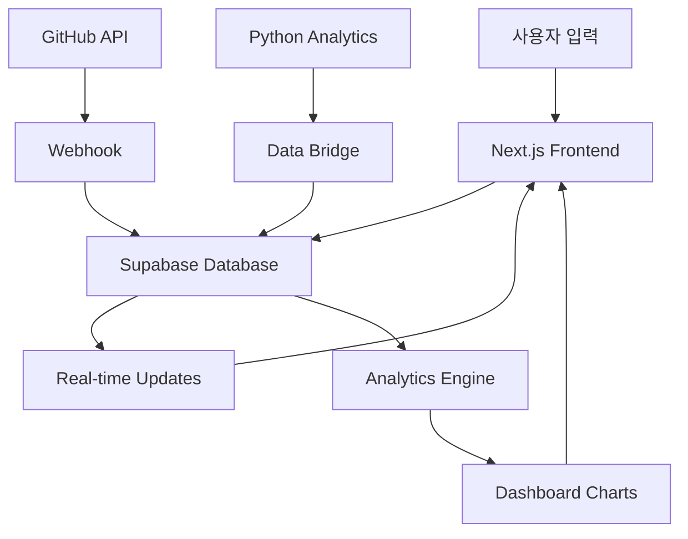

# LG DX School Dashboard Project 

## 📋 프로젝트 개요

LG DX School 수업 경과보고를 위한 실시간 동적 웹 대시보드 프로젝트입니다. 3-Part 시스템(오전수업, 오후수업, 저녁자율학습)을 기반으로 한 일일 리플렉션과 학습 진도 추적을 실시간으로 관리할 수 있는 웹 애플리케이션입니다.

### 🎯 주요 목표

- **실시간 학습 진도 추적**: 3-Part 시스템을 통한 체계적인 일일 학습 기록
- **자동화된 데이터 수집**: GitHub 활동 자동 수집 및 분석
- **시각적 대시보드**: 직관적인 차트와 그래프를 통한 학습 현황 파악
- **개인화된 분석**: 개인 최적 학습 시간대 및 패턴 분석
- **진도 관리**: 과목별 학습 진도 및 목표 달성도 추적

### 🌟 핵심 기능

#### 1. Daily Reflection System
- **3-Part 리플렉션**: 오전/오후/저녁 각 시간대별 학습 기록
- **자동 점수 계산**: 이해도, 집중도, 성취도 기반 종합 점수
- **GitHub 활동 연동**: 커밋, 이슈, PR 자동 수집
- **실시간 업데이트**: 입력과 동시에 대시보드 반영

#### 2. Analytics Dashboard
- **성과 트렌드 차트**: 시간대별, 일별, 주별 성과 분석
- **레이더 차트**: 다차원 성과 비교 분석
- **히트맵**: GitHub 활동 패턴 시각화
- **진도율 추적**: 과목별 학습 진도 및 완성도

#### 3. Smart Insights
- **최적 학습 시간 분석**: 개인별 최고 성과 시간대 도출
- **학습 패턴 분석**: 일관성 및 개선 영역 식별
- **목표 추천**: AI 기반 학습 목표 및 계획 제안
- **주간/월간 리포트**: 자동 생성되는 상세 분석 보고서

### 🛠 기술 스택

#### Frontend
- **Framework**: Next.js 14 (App Router)
- **Language**: TypeScript
- **Styling**: Tailwind CSS
- **Charts**: Recharts / Chart.js
- **State Management**: Zustand
- **UI Components**: Radix UI + Shadcn/ui

#### Backend
- **Database**: Supabase (PostgreSQL)
- **Real-time**: Supabase Realtime
- **Authentication**: Supabase Auth
- **API**: Next.js API Routes
- **File Storage**: Supabase Storage

#### Infrastructure
- **Hosting**: Vercel
- **Domain**: posmul.com
- **CI/CD**: GitHub Actions
- **Monitoring**: Vercel Analytics

#### Integration
- **GitHub API**: 활동 데이터 자동 수집
- **Python Bridge**: 기존 분석 시스템 연동
- **Webhook**: 실시간 데이터 동기화

### 🌐 도메인 구조

```
posmul.com
├── /                    # 메인 대시보드
├── /reflection          # 일일 리플렉션
│   ├── /morning        # 오전 수업 리플렉션
│   ├── /afternoon      # 오후 수업 리플렉션
│   └── /evening        # 저녁 자율학습 리플렉션
├── /analytics          # 분석 대시보드
│   ├── /trends         # 트렌드 분석
│   ├── /comparison     # 성과 비교
│   └── /insights       # 개인화 인사이트
├── /progress           # 학습 진도
│   ├── /subjects       # 과목별 진도
│   └── /goals          # 목표 관리
└── /reports            # 리포트
    ├── /weekly         # 주간 리포트
    └── /monthly        # 월간 리포트
```

### 📊 데이터 흐름



### 🎨 UI/UX 설계 원칙

#### Design System
- **색상 테마**: LG 브랜드 컬러 기반
- **다크/라이트 모드**: 사용자 선택 가능
- **반응형 디자인**: 모바일/태블릿/데스크톱 최적화
- **접근성**: WCAG 2.1 AA 준수

#### User Experience
- **직관적 네비게이션**: 간단하고 명확한 메뉴 구조
- **실시간 피드백**: 즉시 반영되는 시각적 피드백
- **개인화**: 사용자별 맞춤 대시보드
- **성능 최적화**: 3초 이내 페이지 로딩

### 📈 성공 지표 (KPI)

#### 사용성 지표
- **일일 리플렉션 완성률**: 90% 이상
- **대시보드 접속 빈도**: 주 5회 이상
- **평균 세션 시간**: 10분 이상
- **사용자 만족도**: 4.5/5.0 이상

#### 기술적 지표
- **페이지 로딩 시간**: 3초 이내
- **실시간 업데이트 지연**: 1초 이내
- **시스템 가용성**: 99.9% 이상
- **데이터 정확성**: 99.5% 이상

### 🔒 보안 및 프라이버시

#### 데이터 보안
- **인증/인가**: Supabase Auth + JWT
- **HTTPS**: 전체 통신 암호화
- **환경 변수**: 민감 정보 보호
- **SQL Injection**: Supabase ORM 사용

#### 프라이버시 보호
- **개인정보 최소화**: 필요한 데이터만 수집
- **데이터 익명화**: 분석 시 개인 식별 정보 제거
- **사용자 동의**: 데이터 수집 및 활용 동의
- **데이터 보관**: 최대 2년, 사용자 요청 시 삭제

### 🔄 유지보수 및 확장성

#### 코드 품질
- **TypeScript**: 타입 안정성 보장
- **ESLint/Prettier**: 코드 스타일 통일
- **Jest/Cypress**: 자동화된 테스트
- **Git Flow**: 체계적인 버전 관리

#### 모니터링
- **에러 트래킹**: Sentry 연동
- **성능 모니터링**: Vercel Analytics
- **사용자 행동 분석**: Google Analytics
- **알림 시스템**: Discord/Slack 연동

---

**📅 프로젝트 기간**: 4-6주  
**👥 개발자**: 1명 (본인)  
**🚀 런칭 목표**: 2025년 8월  
**📧 문의**: posmul.com 관리자  

## 🎉 최신 업데이트 (2025-07-12)

### Phase 1.3 완료 - Supabase Auth 구현
- ✅ **완전한 인증 시스템**: 로그인, 회원가입, 로그아웃
- ✅ **보안 미들웨어**: 보호된 라우트 자동 관리
- ✅ **실시간 상태 관리**: React Context 기반 전역 인증 상태
- ✅ **타입 안전성**: 100% TypeScript 구현
- ✅ **사용자 경험**: 직관적인 플로우 및 자동 리다이렉션

### 현재 진행률
- **Phase 1**: 75% 완료 (3/4)
- **전체 프로젝트**: 21.4% 완료 (3/14 섹션)
- **다음 단계**: Phase 2.1 리플렉션 시스템 구현 권장  