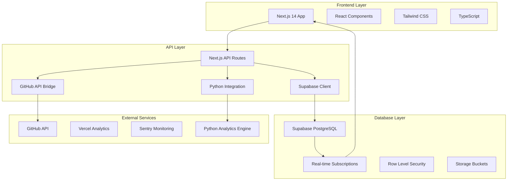

# Technical Architecture & Implementation Guide

## 🏗 시스템 아키텍처

### 전체 시스템 구조



### 기술 스택 상세

#### Frontend Stack
```json
{
  "framework": "Next.js 14.0+",
  "language": "TypeScript 5.0+",
  "styling": "Tailwind CSS 3.0+",
  "ui_library": "Shadcn/ui + Radix UI",
  "charts": "Recharts 2.0+",
  "state_management": "Zustand 4.0+",
  "forms": "React Hook Form + Zod",
  "animations": "Framer Motion",
  "icons": "Lucide React"
}
```

#### Backend Stack
```json
{
  "database": "Supabase (PostgreSQL 15+)",
  "authentication": "Supabase Auth",
  "real_time": "Supabase Realtime",
  "api": "Next.js API Routes",
  "orm": "Supabase JavaScript Client",
  "validation": "Zod",
  "middleware": "Next.js Middleware"
}
```

#### Infrastructure Stack
```json
{
  "hosting": "Vercel",
  "domain": "posmul.com",
  "cdn": "Vercel Edge Network",
  "analytics": "Vercel Analytics",
  "monitoring": "Sentry",
  "ci_cd": "GitHub Actions",
  "environment": "Vercel Environment Variables"
}
```

## 📁 프로젝트 구조

```
lg-dx-dashboard/
├── 📁 app/                          # Next.js 14 App Router
│   ├── 📁 (dashboard)/              # Dashboard route group
│   │   ├── page.tsx                 # Main dashboard page
│   │   ├── layout.tsx               # Dashboard layout
│   │   └── loading.tsx              # Loading UI
│   ├── 📁 reflection/               # Reflection pages
│   │   ├── 📁 morning/
│   │   │   ├── page.tsx
│   │   │   └── loading.tsx
│   │   ├── 📁 afternoon/
│   │   │   ├── page.tsx
│   │   │   └── loading.tsx
│   │   └── 📁 evening/
│   │       ├── page.tsx
│   │       └── loading.tsx
│   ├── 📁 analytics/                # Analytics pages
│   │   ├── 📁 trends/
│   │   ├── 📁 comparison/
│   │   └── 📁 insights/
│   ├── 📁 api/                      # API routes
│   │   ├── 📁 reflections/
│   │   │   ├── route.ts
│   │   │   └── 📁 [id]/
│   │   ├── 📁 github/
│   │   │   ├── webhook/route.ts
│   │   │   └── sync/route.ts
│   │   ├── 📁 analytics/
│   │   │   ├── trends/route.ts
│   │   │   └── insights/route.ts
│   │   └── 📁 python-bridge/
│   │       ├── sync/route.ts
│   │       └── migrate/route.ts
│   ├── globals.css                  # Global styles
│   ├── layout.tsx                   # Root layout
│   └── page.tsx                     # Home page
├── 📁 components/                   # React components
│   ├── 📁 ui/                       # Base UI components (Shadcn)
│   │   ├── button.tsx
│   │   ├── card.tsx
│   │   ├── form.tsx
│   │   └── ...
│   ├── 📁 dashboard/                # Dashboard components
│   │   ├── today-summary.tsx
│   │   ├── weekly-chart.tsx
│   │   ├── progress-cards.tsx
│   │   └── real-time-updates.tsx
│   ├── 📁 forms/                    # Form components
│   │   ├── reflection-form.tsx
│   │   ├── goal-form.tsx
│   │   └── subject-form.tsx
│   ├── 📁 charts/                   # Chart components
│   │   ├── radar-chart.tsx
│   │   ├── trend-chart.tsx
│   │   ├── heatmap.tsx
│   │   └── progress-bar.tsx
│   ├── 📁 layout/                   # Layout components
│   │   ├── header.tsx
│   │   ├── sidebar.tsx
│   │   ├── footer.tsx
│   │   └── navigation.tsx
│   └── 📁 providers/                # Context providers
│       ├── supabase-provider.tsx
│       ├── theme-provider.tsx
│       └── auth-provider.tsx
├── 📁 lib/                          # Utility libraries
│   ├── supabase/                    # Supabase configuration
│   │   ├── client.ts                # Client-side Supabase
│   │   ├── server.ts                # Server-side Supabase
│   │   └── middleware.ts            # Auth middleware
│   ├── github/                      # GitHub integration
│   │   ├── api.ts                   # GitHub API client
│   │   ├── webhook.ts               # Webhook handlers
│   │   └── types.ts                 # GitHub types
│   ├── python-bridge/               # Python system integration
│   │   ├── client.ts                # Python bridge client
│   │   ├── migrate.ts               # Data migration
│   │   └── sync.ts                  # Real-time sync
│   ├── analytics/                   # Analytics utilities
│   │   ├── calculator.ts            # Score calculations
│   │   ├── insights.ts              # Insight generation
│   │   └── trends.ts                # Trend analysis
│   ├── validations/                 # Zod schemas
│   │   ├── reflection.ts
│   │   ├── user.ts
│   │   └── common.ts
│   └── utils/                       # Common utilities
│       ├── cn.ts                    # Class name utility
│       ├── date.ts                  # Date utilities
│       ├── format.ts                # Formatting utilities
│       └── constants.ts             # App constants
├── 📁 hooks/                        # Custom React hooks
│   ├── use-realtime.ts              # Real-time subscriptions
│   ├── use-github.ts                # GitHub data hooks
│   ├── use-analytics.ts             # Analytics hooks
│   └── use-reflection.ts            # Reflection hooks
├── 📁 types/                        # TypeScript type definitions
│   ├── database.ts                  # Database types
│   ├── api.ts                       # API types
│   ├── github.ts                    # GitHub types
│   └── analytics.ts                 # Analytics types
├── 📁 styles/                       # Additional styles
│   └── charts.css                   # Chart-specific styles
├── 📁 public/                       # Static assets
│   ├── 📁 icons/                    # App icons
│   ├── 📁 images/                   # Images
│   └── favicon.ico
├── 📁 docs/                         # Documentation
│   ├── api.md                       # API documentation
│   ├── deployment.md                # Deployment guide
│   └── contributing.md              # Contributing guide
├── 📁 scripts/                      # Build/deployment scripts
│   ├── migrate.js                   # Database migration
│   ├── seed.js                      # Database seeding
│   └── deploy.js                    # Deployment script
├── .env.local                       # Environment variables
├── .env.example                     # Environment example
├── next.config.js                   # Next.js configuration
├── tailwind.config.js               # Tailwind configuration
├── tsconfig.json                    # TypeScript configuration
├── package.json                     # Dependencies
└── README.md                        # Project README
```

## 🔧 Core Services

### 1. Authentication Service
```typescript
// lib/supabase/auth.ts
export class AuthService {
  async signIn(email: string, password: string)
  async signUp(email: string, password: string, userData: UserData)
  async signOut()
  async getCurrentUser()
  async updateProfile(updates: Partial<UserProfile>)
}
```

### 2. Reflection Service
```typescript
// lib/services/reflection.ts
export class ReflectionService {
  async createReflection(data: CreateReflectionData)
  async updateReflection(id: string, data: UpdateReflectionData)
  async getReflectionsByDate(date: string)
  async getReflectionsByPeriod(startDate: string, endDate: string)
  async subscribeToReflections(callback: (data: Reflection[]) => void)
}
```

### 3. Analytics Service
```typescript
// lib/services/analytics.ts
export class AnalyticsService {
  async calculateDailyScore(reflections: Reflection[])
  async generateTrendAnalysis(period: number)
  async getOptimalLearningTimes(userId: string)
  async generateInsights(userId: string)
  async createProgressReport(userId: string, period: string)
}
```

### 4. GitHub Integration Service
```typescript
// lib/services/github.ts
export class GitHubService {
  async fetchUserActivity(username: string, date: string)
  async syncCommitData(username: string)
  async webhookHandler(payload: GitHubWebhookPayload)
  async getActivityHeatmap(username: string, days: number)
}
```

## 🗄 Database Architecture

### Supabase Configuration
```sql
-- Enable required extensions
CREATE EXTENSION IF NOT EXISTS "uuid-ossp";
CREATE EXTENSION IF NOT EXISTS "pgcrypto";

-- Enable Row Level Security
ALTER TABLE users ENABLE ROW LEVEL SECURITY;
ALTER TABLE daily_reflections ENABLE ROW LEVEL SECURITY;
ALTER TABLE learning_progress ENABLE ROW LEVEL SECURITY;
ALTER TABLE goals ENABLE ROW LEVEL SECURITY;

-- RLS Policies
CREATE POLICY "Users can read own data" ON users
    FOR SELECT USING (auth.uid() = id);

CREATE POLICY "Users can insert own reflections" ON daily_reflections
    FOR INSERT WITH CHECK (auth.uid() = user_id);

CREATE POLICY "Users can read own reflections" ON daily_reflections
    FOR SELECT USING (auth.uid() = user_id);
```

### Real-time Subscriptions
```typescript
// lib/supabase/realtime.ts
export const subscribeToReflections = (
  userId: string,
  callback: (payload: any) => void
) => {
  return supabase
    .channel('reflections')
    .on(
      'postgres_changes',
      {
        event: '*',
        schema: 'public',
        table: 'daily_reflections',
        filter: `user_id=eq.${userId}`
      },
      callback
    )
    .subscribe();
};
```

## 🚀 Performance Optimization

### 1. Code Splitting
```typescript
// Dynamic imports for heavy components
const AnalyticsChart = dynamic(() => import('@/components/charts/analytics-chart'), {
  loading: () => <ChartSkeleton />,
  ssr: false
});
```

### 2. Data Fetching Strategy
```typescript
// app/dashboard/page.tsx
export default async function DashboardPage() {
  // Parallel data fetching
  const [reflections, analytics, goals] = await Promise.all([
    getRecentReflections(),
    getAnalyticsSummary(),
    getActiveGoals()
  ]);

  return <DashboardView data={{ reflections, analytics, goals }} />;
}
```

### 3. Caching Strategy
```typescript
// lib/cache.ts
export const getCachedAnalytics = unstable_cache(
  async (userId: string) => {
    return await analyticsService.generateInsights(userId);
  },
  ['analytics'],
  { revalidate: 3600 } // 1 hour cache
);
```

## 🔒 Security Implementation

### 1. Environment Variables
```bash
# .env.local
NEXT_PUBLIC_SUPABASE_URL=your_supabase_url
NEXT_PUBLIC_SUPABASE_ANON_KEY=your_anon_key
SUPABASE_SERVICE_ROLE_KEY=your_service_role_key
GITHUB_TOKEN=your_github_token
GITHUB_WEBHOOK_SECRET=your_webhook_secret
NEXTAUTH_SECRET=your_nextauth_secret
```

### 2. API Route Protection
```typescript
// middleware.ts
export async function middleware(request: NextRequest) {
  const { supabase, response } = createMiddlewareClient({ req: request });
  
  const { data: { session } } = await supabase.auth.getSession();
  
  if (!session && request.nextUrl.pathname.startsWith('/dashboard')) {
    return NextResponse.redirect(new URL('/login', request.url));
  }
  
  return response;
}
```

### 3. Input Validation
```typescript
// lib/validations/reflection.ts
export const reflectionSchema = z.object({
  date: z.string().regex(/^\d{4}-\d{2}-\d{2}$/),
  time_part: z.enum(['morning', 'afternoon', 'evening']),
  understanding_score: z.number().min(1).max(10),
  concentration_score: z.number().min(1).max(10),
  achievement_score: z.number().min(1).max(10),
  condition: z.enum(['좋음', '보통', '나쁨']),
  notes: z.string().max(1000).optional()
});
```

## 📊 Monitoring & Analytics

### 1. Error Tracking
```typescript
// lib/monitoring/sentry.ts
import * as Sentry from "@sentry/nextjs";

Sentry.init({
  dsn: process.env.SENTRY_DSN,
  tracesSampleRate: 1.0,
  environment: process.env.NODE_ENV,
});
```

### 2. Performance Monitoring
```typescript
// lib/monitoring/performance.ts
export const trackPageView = (page: string) => {
  if (typeof window !== 'undefined') {
    // Track with Vercel Analytics
    va.track('pageview', { page });
  }
};
```

### 3. Custom Metrics
```typescript
// lib/monitoring/metrics.ts
export const trackReflectionSubmission = (timepart: string) => {
  va.track('reflection_submitted', { timepart });
};

export const trackDashboardInteraction = (component: string) => {
  va.track('dashboard_interaction', { component });
};
```

---

**🔄 업데이트 주기**: 매 스프린트마다 기술 문서 업데이트  
**📋 리뷰 프로세스**: 주요 아키텍처 변경 시 코드 리뷰 필수  
**🚀 배포 전략**: Blue-Green 배포를 통한 무중단 서비스  