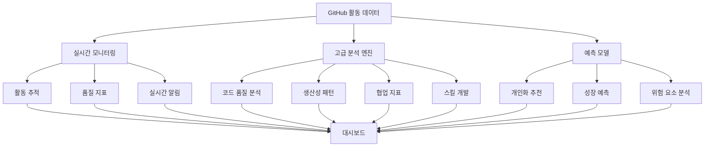
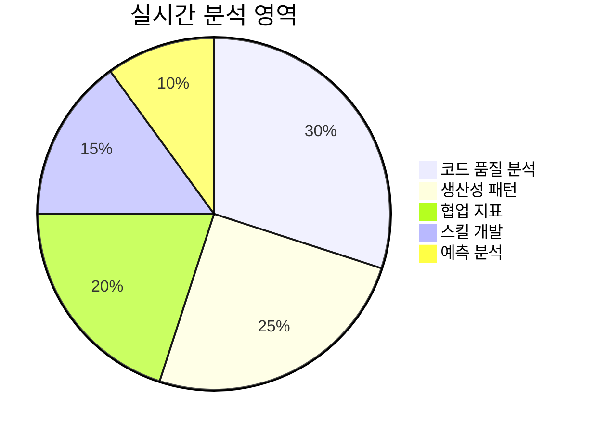
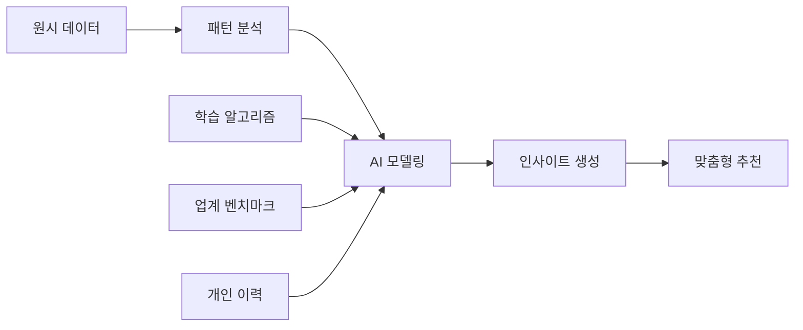
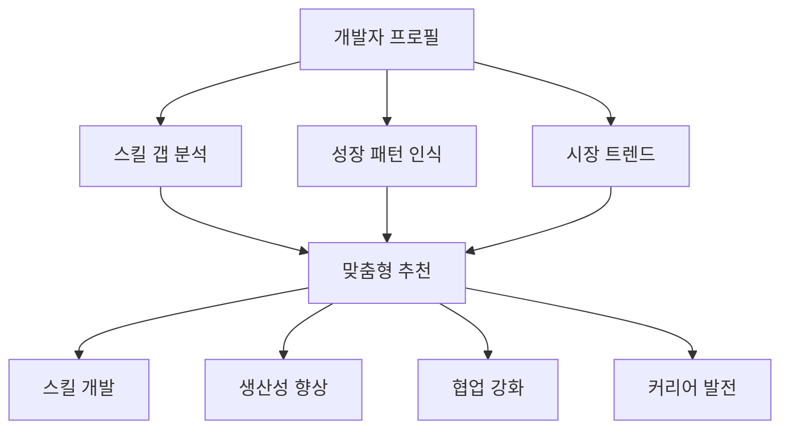
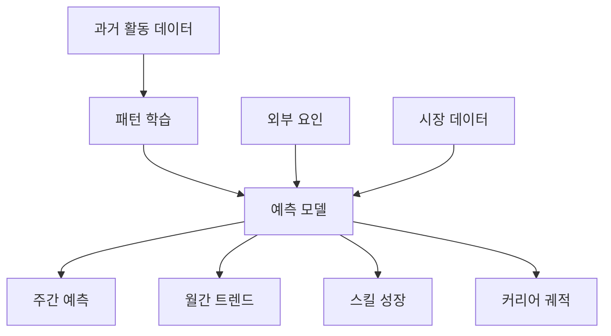
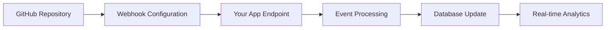
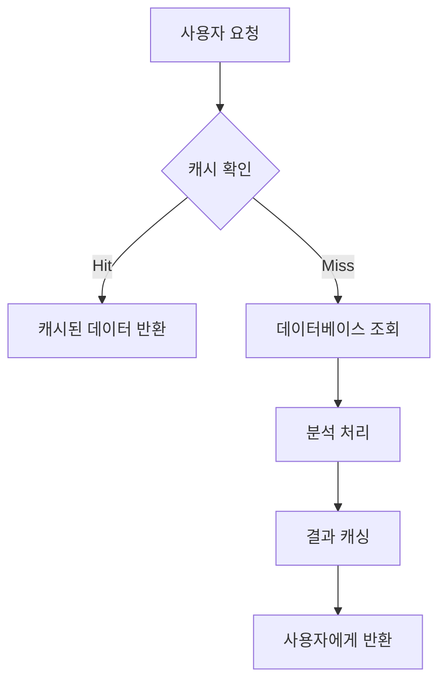
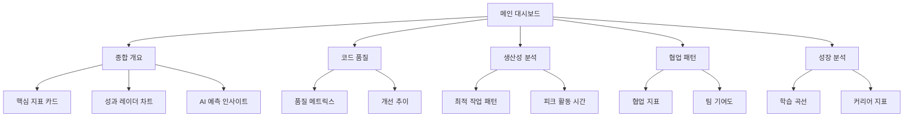

# GitHub 고급 활동 분석 시스템 설정 가이드

## 🎯 **시스템 개요**



## 🚀 **주요 강화 기능**

### 1. **실시간 활동 모니터링**



#### 핵심 메트릭스
- **임팩트 점수**: 활동의 영향력 정량화 (0-100점)
- **품질 지표**: 커밋 메시지, 코드 변경 크기, 테스트 커버리지
- **협업 패턴**: PR 리뷰, 멘토링, 지식 공유 활동
- **일관성 평가**: 개발 패턴의 안정성 분석

### 2. **AI 기반 고급 분석**



#### 분석 카테고리
1. **코드 품질 메트릭스**
   - 평균 파일 크기 분석
   - 코드 복잡도 점수
   - 테스트 커버리지 추정
   - 문서화 비율 평가

2. **생산성 인사이트**
   - 피크 시간대 식별
   - 집중 시간 블록 분석
   - 컨텍스트 스위칭 빈도
   - 플로우 상태 지표

3. **협업 패턴 분석**
   - PR 리뷰 참여도
   - 멘토링 활동 수준
   - 지식 공유 점수
   - 팀 기여도 균형

### 3. **개인화된 성장 추천**



#### 추천 시스템 특징
- **개인별 맞춤화**: 개발 스타일과 목표에 기반한 추천
- **우선순위 기반**: 임팩트와 실행 가능성을 고려한 순위
- **실행 계획**: 구체적인 액션 아이템과 성공 지표 제공
- **진행 추적**: 추천 이행 상황 모니터링

### 4. **예측 분석 모델**



#### 예측 기능
1. **단기 예측** (1주일)
   - 예상 커밋 수
   - 품질 점수 전망
   - 생산성 지수

2. **중기 트렌드** (6개월)
   - 활동 패턴 변화
   - 스킬 성장 속도
   - 협업 수준 변화

3. **장기 궤적** (1년+)
   - 커리어 발전 방향
   - 전문성 영역 예측
   - 리더십 준비도

## 📊 **설치 및 설정**

### 1. **데이터베이스 스키마 적용**

```bash
# Supabase SQL 에디터에서 실행
psql -h your-supabase-host -U postgres -d postgres -f scripts/github-advanced-analytics-schema.sql
```

### 2. **환경 변수 설정**

```env
# .env.local 파일에 추가
GITHUB_WEBHOOK_SECRET=your_webhook_secret_here
NEXT_PUBLIC_SUPABASE_URL=your_supabase_url
NEXT_PUBLIC_SUPABASE_ANON_KEY=your_supabase_anon_key
SUPABASE_SERVICE_ROLE_KEY=your_service_role_key
```

### 3. **GitHub 웹훅 설정**



#### 웹훅 이벤트 구독
- `push` - 코드 푸시 이벤트
- `pull_request` - PR 생성/수정/병합
- `issues` - 이슈 생성/수정/종료
- `release` - 릴리즈 이벤트
- `fork` - 저장소 포크
- `star` - 저장소 스타

### 4. **컴포넌트 통합**

```tsx
// pages/dashboard.tsx
import GitHubAdvancedAnalytics from '@/components/GitHubAdvancedAnalytics'

export default function Dashboard() {
  return (
    <div>
      <GitHubAdvancedAnalytics 
        userId="user-id-here" 
        period={90} 
      />
    </div>
  )
}
```

## 🔧 **API 엔드포인트**

### 고급 분석 API
```
GET /api/github/advanced-analytics
- type: comprehensive | code_quality | productivity | collaboration | skill_development | predictive
- user_id: string (required)
- period: number (default: 90)
```

### 실시간 모니터링 API
```
GET /api/github/realtime-monitor
POST /api/github/realtime-monitor (webhook)
- user_id: string (required)
- limit: number (default: 50)
- type: string (optional)
```

### 예측 및 추천 API
```
GET /api/github/predictions
- type: comprehensive | recommendations | predictions
- user_id: string (required)
```

## 📈 **성능 최적화**

### 1. **데이터 캐싱 전략**



### 2. **배치 처리**
- 시간당 데이터 집계
- 일별 메트릭스 계산
- 주간 추세 분석
- 월간 리포트 생성

### 3. **실시간 처리 최적화**
- 웹훅 이벤트 큐잉
- 비동기 분석 처리
- 점진적 메트릭스 업데이트

## 🛡️ **보안 고려사항**

### 1. **데이터 보호**
- 개인 정보 암호화
- GitHub 토큰 안전 저장
- RLS(Row Level Security) 적용

### 2. **API 보안**
- 웹훅 서명 검증
- 사용자 인증 확인
- 접근 권한 제어

### 3. **개인정보 처리**
- 최소 데이터 수집 원칙
- 사용자 동의 기반 처리
- 데이터 보존 기간 관리

## 📱 **사용자 인터페이스**

### 대시보드 구성



### 상호작용 기능
- **실시간 업데이트**: 새로운 활동 즉시 반영
- **드릴다운 분석**: 상세 데이터 탐색
- **맞춤형 필터링**: 기간, 프로젝트별 필터
- **내보내기 기능**: PDF, CSV 리포트 생성

## 🎯 **활용 시나리오**

### 개인 개발자
- 개발 습관 개선
- 스킬 성장 추적
- 생산성 최적화
- 커리어 계획 수립

### 팀 리더
- 팀원 성장 모니터링
- 코드 품질 관리
- 협업 효율성 개선
- 멘토링 대상 식별

### 조직 관리자
- 개발 역량 평가
- 교육 프로그램 기획
- 인재 육성 전략
- 성과 측정 및 보상

## 🔮 **향후 확장 계획**

### 1. **ML 모델 고도화**
- 딥러닝 기반 패턴 인식
- 자연어 처리를 통한 커밋 메시지 분석
- 이미지 인식을 통한 코드 품질 평가

### 2. **통합 분석**
- Jira, Slack 연동
- CI/CD 파이프라인 메트릭스
- 코드 리뷰 품질 분석

### 3. **협업 기능**
- 팀 비교 분석
- 베스트 프랙티스 공유
- 멘토-멘티 매칭 시스템

## 📚 **참고 자료**

- [GitHub API 문서](https://docs.github.com/en/rest)
- [Supabase 실시간 기능](https://supabase.com/docs/guides/realtime)
- [Next.js API Routes](https://nextjs.org/docs/api-routes/introduction)
- [Recharts 문서](https://recharts.org/en-US/guide)

---

## 🎉 **결론**

이 고급 GitHub 활동 분석 시스템은 개발자의 성장과 생산성 향상을 위한 종합적인 솔루션을 제공합니다. AI 기반 인사이트와 개인화된 추천을 통해 더 나은 개발자가 되는 여정을 지원합니다.

**주요 혜택:**
- 📊 **데이터 기반 의사결정**: 객관적 지표를 통한 개선 방향 설정
- 🎯 **맞춤형 성장**: 개인 특성에 맞는 발전 방안 제시
- ⚡ **실시간 피드백**: 즉각적인 활동 분석 및 알림
- 🔮 **미래 예측**: AI 기반 성장 궤적 및 리스크 예측

지속적인 업데이트와 피드백을 통해 더욱 정확하고 유용한 분석 시스템으로 발전시켜 나가겠습니다.
