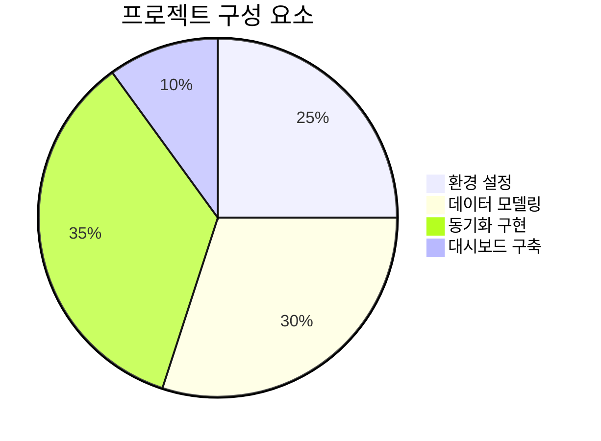
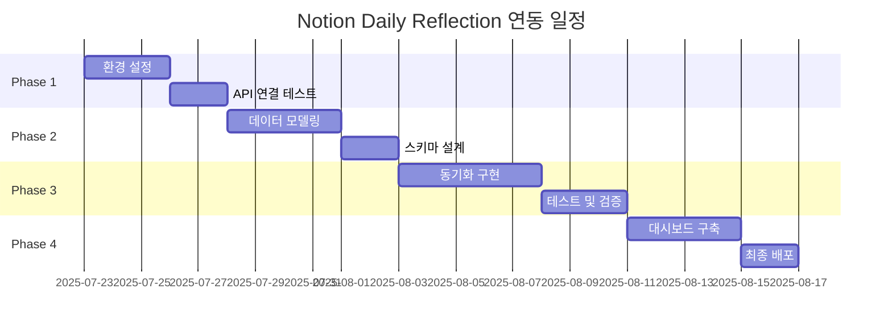
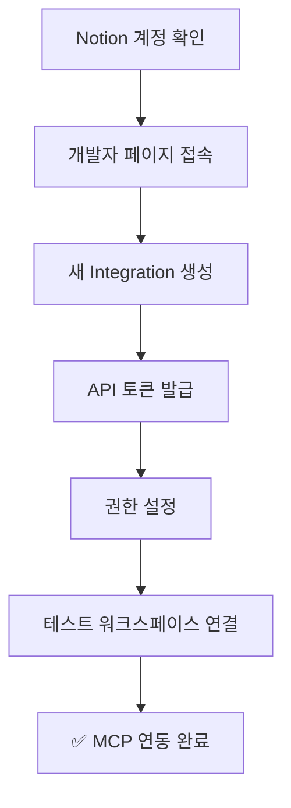
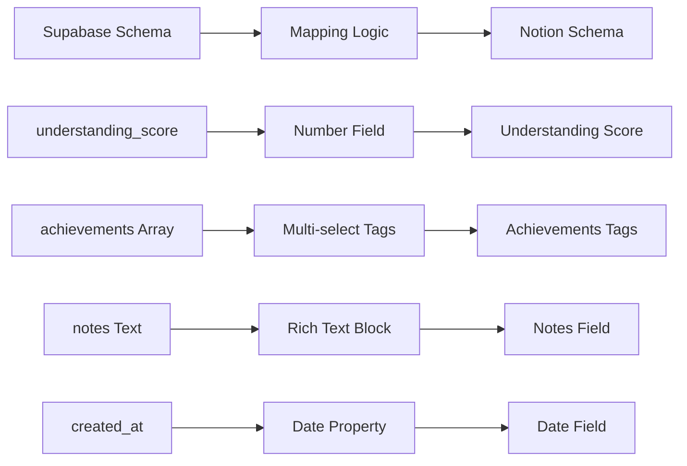
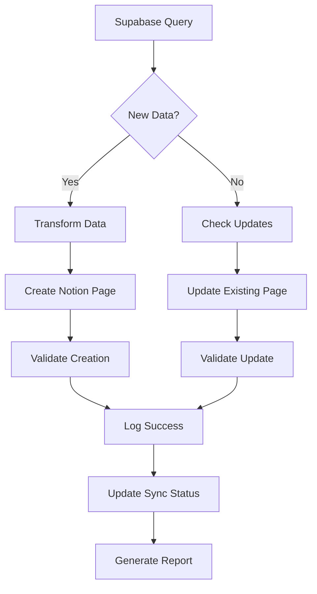
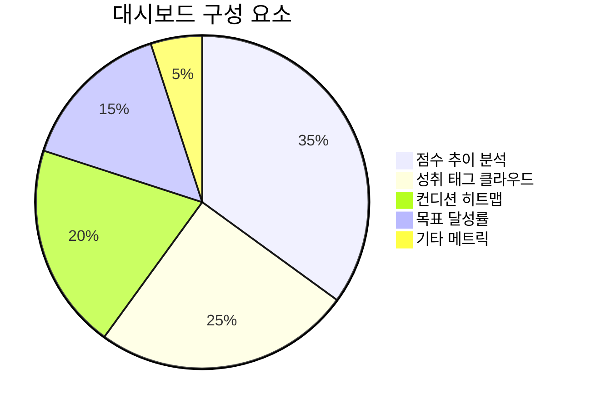
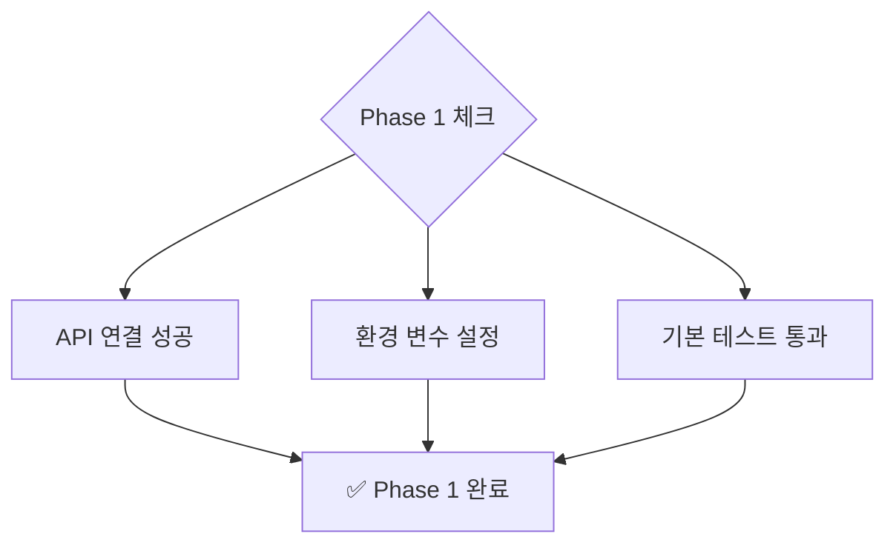
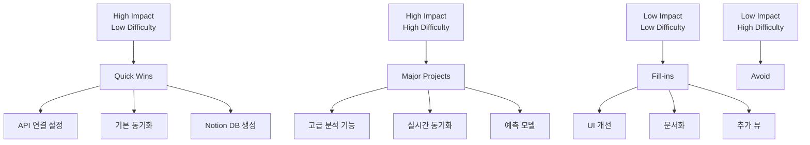
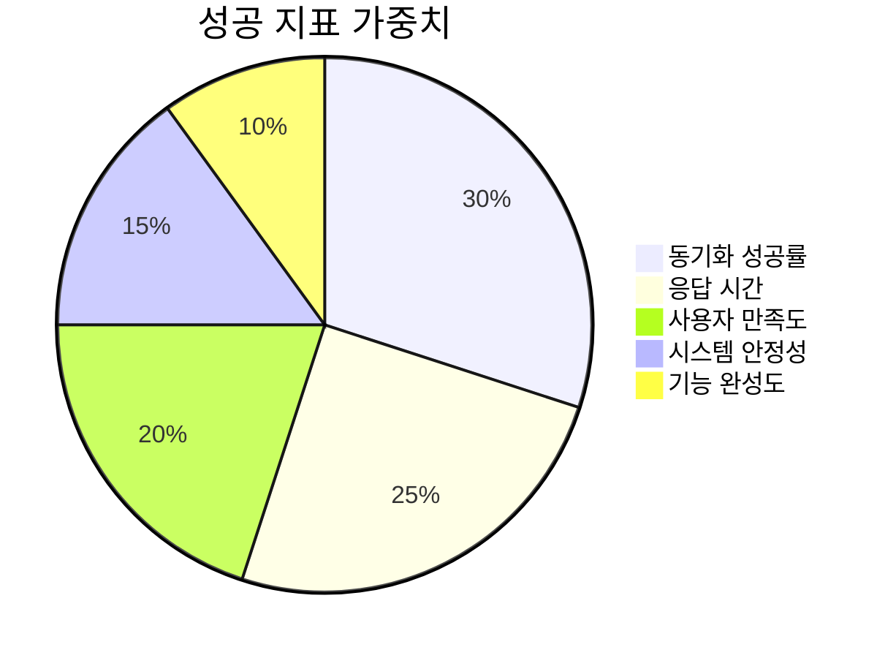

# 📋 Notion Daily Reflection 연동 작업 목록

> **프로젝트**: LG DX Dashboard - Notion 통합  
> **목표**: Supabase Daily Reflection 데이터를 Notion으로 동기화하여 시각적 대시보드 구축  
> **생성일**: 2025-07-23

## 🎯 **프로젝트 개요**



### 📊 **전체 진행률 대시보드**



---

## 📌 **Phase 1: 환경 설정 및 기반 구축** 
*예상 기간: 3-5일*

### 🔧 **1.1 Notion API 설정** ✅



**작업 항목:**
- [x] **1.1.1** Notion 계정 및 워크스페이스 준비
- [x] **1.1.2** [Notion Developers](https://developers.notion.com/) 접속  
- [x] **1.1.3** 새로운 Integration 생성 (`LG DX Dashboard`)
- [x] **1.1.4** API 토큰 발급 및 보안 저장
- [x] **1.1.5** 워크스페이스 연결 권한 설정
- [x] **1.1.6** 기본 권한 검증 (읽기/쓰기/생성)

### 🌐 **1.2 환경 변수 구성** ✅

**작업 항목:**
- [x] **1.2.1** `.env.local` 파일에 Notion 설정 추가
  ```bash
  NOTION_API_TOKEN=secret_xxx...
  NOTION_WORKSPACE_ID=xxx...
  NOTION_PARENT_PAGE_ID=xxx...
  ```
- [x] **1.2.2** 환경 변수 로드 테스트
- [x] **1.2.3** 보안 검증 (토큰 암호화/마스킹)

### 🧪 **1.3 기본 연결 테스트** ✅

**작업 항목:**
- [x] **1.3.1** `mcp_notion_API-get-self` 실행으로 연결 확인
- [x] **1.3.2** 워크스페이스 사용자 목록 조회 테스트
- [x] **1.3.3** 기본 페이지 생성/삭제 테스트
- [x] **1.3.4** 오류 처리 로직 구현

---

## 🏗️ **Phase 2: 데이터 모델링 및 스키마 설계**
*예상 기간: 4-6일*

### 📊 **2.1 Notion 데이터베이스 스키마 설계** ✅



**작업 항목:**
- [x] **2.1.1** Daily Reflection 필드 매핑 분석
- [x] **2.1.2** Notion 속성 타입별 스키마 정의
- [x] **2.1.3** 수식 필드 설계 (총점 자동 계산)
- [x] **2.1.4** 선택 옵션 리스트 구성 (컨디션, 시간대)
- [x] **2.1.5** 멀티셀렉트 태그 시스템 설계

### 🔗 **2.2 데이터 변환 로직 구현** ✅

**작업 항목:**
- [x] **2.2.1** `transform_reflection_to_notion()` 함수 완성
- [x] **2.2.2** 데이터 타입 검증 로직 추가
- [x] **2.2.3** 누락 데이터 처리 방안 구현
- [x] **2.2.4** 배열 → 멀티셀렉트 변환 로직
- [x] **2.2.5** 날짜/시간 형식 표준화

### 📋 **2.3 Notion 데이터베이스 생성** ✅

**작업 항목:**
- [x] **2.3.1** 부모 페이지 생성 (`Daily Reflections Hub`)
- [x] **2.3.2** `mcp_notion_API-create-a-database` 실행
- [x] **2.3.3** 데이터베이스 속성 설정 검증
- [x] **2.3.4** 템플릿 페이지 생성
- [x] **2.3.5** 뷰 설정 (테이블/캘린더/갤러리)

---

## 🔄 **Phase 3: 동기화 로직 구현**
*예상 기간: 5-7일*

### ⚡ **3.1 동기화 흐름 구현**



**작업 항목:**
- [ ] **3.1.1** Supabase → Notion 단방향 동기화 구현
- [ ] **3.1.2** 중복 데이터 방지 로직 (Supabase ID 기반)
- [ ] **3.1.3** 증분 동기화 (마지막 동기화 이후 데이터만)
- [ ] **3.1.4** 배치 처리 로직 (여러 레코드 한번에)
- [ ] **3.1.5** 동기화 상태 추적 시스템

### 🛠️ **3.2 오류 처리 및 재시도 로직**

**작업 항목:**
- [ ] **3.2.1** API 율제한 처리 (Rate Limiting)
- [ ] **3.2.2** 네트워크 오류 재시도 메커니즘
- [ ] **3.2.3** 데이터 검증 실패 처리
- [ ] **3.2.4** 로그 시스템 구축 (성공/실패/경고)
- [ ] **3.2.5** 알림 시스템 (중요 오류 발생시)

### 🧪 **3.3 테스트 및 검증**

**작업 항목:**
- [ ] **3.3.1** 샘플 데이터로 동기화 테스트
- [ ] **3.3.2** 대용량 데이터 처리 성능 테스트
- [ ] **3.3.3** 동시성 처리 테스트
- [ ] **3.3.4** 데이터 무결성 검증
- [ ] **3.3.5** 롤백 메커니즘 테스트

### 📊 **3.4 동기화 모니터링**

**작업 항목:**
- [ ] **3.4.1** 동기화 통계 대시보드 구현
- [ ] **3.4.2** 성능 메트릭 수집 (처리 시간, 성공률)
- [ ] **3.4.3** 오류 분류 및 통계
- [ ] **3.4.4** 알림 규칙 설정
- [ ] **3.4.5** 정기 보고서 생성

---

## 📈 **Phase 4: 대시보드 구축 및 최적화**
*예상 기간: 4-5일*

### 🎨 **4.1 Notion 대시보드 구성**



**작업 항목:**
- [ ] **4.1.1** 메인 대시보드 페이지 구성
- [ ] **4.1.2** 점수 추이 차트 (이해도/집중도/성취도)
- [ ] **4.1.3** 월별/주별 캘린더 뷰 구성
- [ ] **4.1.4** 성취 태그 빈도 분석 페이지
- [ ] **4.1.5** 컨디션별 성과 상관관계 분석

### 📊 **4.2 고급 분석 기능**

**작업 항목:**
- [ ] **4.2.1** 주간/월간 요약 리포트 자동 생성
- [ ] **4.2.2** 학습 패턴 분석 (최적 시간대 찾기)
- [ ] **4.2.3** 목표 달성률 추적 시스템
- [ ] **4.2.4** 개선 제안 알고리즘 구현
- [ ] **4.2.5** 예측 모델 (향후 성과 예측)

### 🔧 **4.3 자동화 설정**

**작업 항목:**
- [ ] **4.3.1** 정기 동기화 스케줄러 설정
- [ ] **4.3.2** GitHub Actions 워크플로우 구성
- [ ] **4.3.3** 웹훅 기반 실시간 동기화 (선택사항)
- [ ] **4.3.4** 백업 및 복구 시스템
- [ ] **4.3.5** 모니터링 및 알림 설정

### 🎯 **4.4 사용자 경험 최적화**

**작업 항목:**
- [ ] **4.4.1** 모바일 접근성 최적화
- [ ] **4.4.2** 검색 및 필터링 기능 강화
- [ ] **4.4.3** 템플릿 및 단축키 설정
- [ ] **4.4.4** 사용자 가이드 문서 작성
- [ ] **4.4.5** 피드백 수집 시스템 구축

---

## 📋 **Phase별 체크리스트**

### ✅ **Phase 1 완료 조건** ✅


- [x] Notion API 토큰 정상 작동
- [x] 환경 변수 모든 설정 완료
- [x] 기본 CRUD 작업 테스트 통과
- [x] 오류 처리 기본 로직 동작

### ✅ **Phase 2 완료 조건** ✅
- [x] Notion 데이터베이스 생성 완료
- [x] 모든 필드 매핑 정상 작동
- [x] 데이터 변환 로직 테스트 통과
- [x] 스키마 검증 완료

### ✅ **Phase 3 완료 조건**
- [ ] 동기화 로직 정상 작동
- [ ] 오류 처리 및 재시도 검증
- [ ] 성능 테스트 통과
- [ ] 모니터링 시스템 동작

### ✅ **Phase 4 완료 조건**
- [ ] 대시보드 모든 기능 동작
- [ ] 자동화 시스템 안정 운영
- [ ] 사용자 가이드 완성
- [ ] 최종 테스트 통과

---

## 🚀 **우선순위 매트릭스**



### 🎯 **즉시 시작 (Quick Wins)**
1. **Notion API 연결 설정** - 기반 기술
2. **기본 동기화 구현** - 핵심 기능
3. **데이터베이스 생성** - 필수 인프라

### 📈 **주요 프로젝트 (Major Projects)**
1. **고급 분석 기능** - 높은 가치
2. **실시간 동기화** - 사용자 경험
3. **자동화 시스템** - 운영 효율성

---

## 🔧 **기술 요구사항**

### 📦 **필수 패키지**
```bash
pip install supabase python-dotenv requests notion-client
```

### 🌐 **API 엔드포인트**
- **Supabase**: 기존 환경 활용
- **Notion API**: `https://api.notion.com/v1/`
- **MCP Notion**: 기존 MCP 도구 활용

### 🔐 **보안 고려사항**
- API 토큰 암호화 저장
- 환경 변수 분리
- 접근 권한 최소화
- 로그 데이터 마스킹

---

## 📊 **성공 지표 (KPI)**



### 📈 **핵심 지표**
- **동기화 성공률**: 99% 이상
- **평균 응답 시간**: 3초 이내
- **시스템 가동시간**: 99.9% 이상
- **오류 발생률**: 1% 미만
- **사용자 만족도**: 4.5/5.0 이상

---

## 📝 **다음 단계**

1. **즉시 실행**: Phase 1의 Notion API 설정부터 시작
2. **리소스 확보**: 필요한 API 토큰 및 권한 준비
3. **팀 협업**: 각 Phase별 담당자 배정
4. **정기 리뷰**: 주 2회 진행 상황 점검

**🚀 시작 준비가 되었습니다! 어떤 Phase부터 시작하시겠습니까?**
